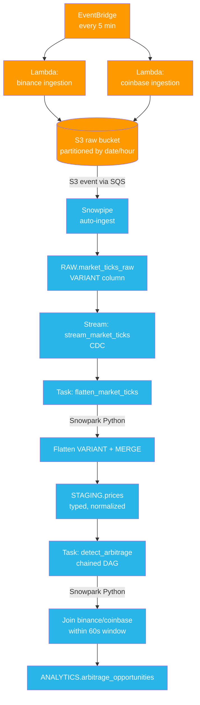

# Architecture

```mermaid
flowchart TB
    EB[EventBridge<br/>every 5 min] --> LB[Lambda:<br/>binance ingestion]
    EB --> LC[Lambda:<br/>coinbase ingestion]
    
    LB --> S3[(S3 raw bucket<br/>partitioned by date/hour)]
    LC --> S3
    
    S3 -->|S3 event via SQS| SP[Snowpipe<br/>auto-ingest]
    SP --> RAW[RAW.market_ticks_raw<br/>VARIANT column]
    
    RAW --> STREAM[Stream: stream_market_ticks<br/>CDC]
    STREAM --> T1[Task: flatten_market_ticks]
    T1 -->|Snowpark Python| PROC1[Flatten VARIANT + MERGE]
    PROC1 --> STG[STAGING.prices<br/>typed, normalized]
    
    STG --> T2[Task: detect_arbitrage<br/>chained DAG]
    T2 -->|Snowpark Python| PROC2[Join binance/coinbase<br/>within 60s window]
    PROC2 --> ANA[ANALYTICS.arbitrage_opportunities]
    
    style EB fill:#FF9900,color:#fff
    style LB fill:#FF9900,color:#fff
    style LC fill:#FF9900,color:#fff
    style S3 fill:#FF9900,color:#fff
    style SP fill:#29B5E8,color:#fff
    style RAW fill:#29B5E8,color:#fff
    style STREAM fill:#29B5E8,color:#fff
    style T1 fill:#29B5E8,color:#fff
    style T2 fill:#29B5E8,color:#fff
    style PROC1 fill:#29B5E8,color:#fff
    style PROC2 fill:#29B5E8,color:#fff
    style STG fill:#29B5E8,color:#fff
    style ANA fill:#29B5E8,color:#fff
```

Orange = AWS · Blue = Snowflake